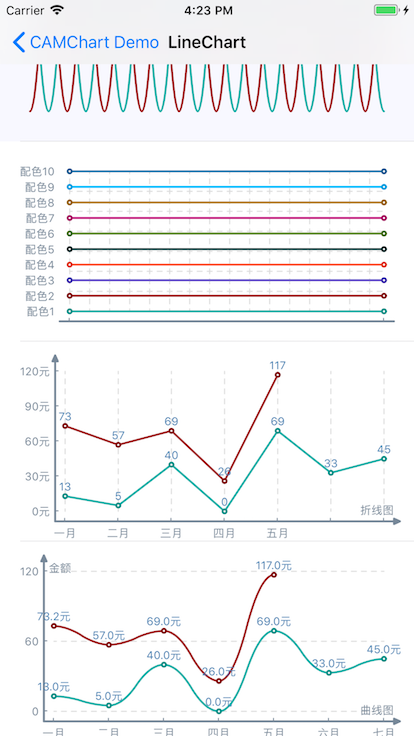

#  CAMChart - ObjC

### Line Chart


```objective-c
CAMChartProfile *profile = [[CAMChartProfileManager shareInstance].defaultProfile mutableCopy];

CAMLineChart *chart = [[CAMLineChart alloc] initWithFrame:CGRectMake(0, 0, 300, 200)];
chart.chartProfile = profile;
chart.xUnit = @"折线图";
chart.xLabels = @[@"一月", @"二月", @"三月", @"四月", @"五月"];

NSArray *data00 = @[@13, @5, @40, @0, @69, @33, @45];
NSArray *data01 = @[@73.2, @57, @69, @26, @117];

[chart addChartData:data00];
[chart addChartData:data01];

[chart drawChart];
```

### CircleProgress Chart


```objective-c
CAMChartProfile *profile_0 = [[CAMChartProfileManager shareInstance].defaultProfile mutableCopy];

CAMCircleProgressChart *chart_0 = [[CAMCircleProgressChart alloc]init];
[chart_0 setFrame:CGRectMake(0, offsetY, screenWidth, 200)];
chart_0.chartProfile = profile_0;
chart_0.topTag = @"Circle Progress";
chart_0.bottomTag = @"camchart";
[chart_0 addChartData:75];

[chart_0 drawChart];
```
